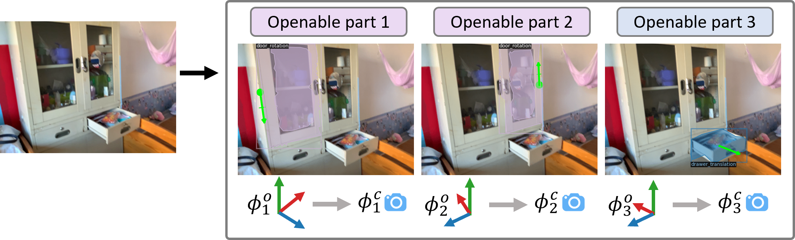

# OPDMulti: Openable Part Detection for Multiple Objects
[Xiaohao Sun*](https://ca.linkedin.com/in/xiaohao-sun-237537195?trk=public_profile_browsemap), [Hanxiao Jiang*](https://jianghanxiao.github.io/), [Manolis Savva](https://msavva.github.io/), [Angel Xuan Chang](http://angelxuanchang.github.io/)

## Overview
This repository contains the implementation of **OPDFormer** based methods for the new proposed **OPDMulti** task and corresponding dataset. The code is based on [Detectron2](https://github.com/facebookresearch/detectron2) and [OPD](https://github.com/3dlg-hcvc/OPD.git). And the **OPDFormer** models was built on [Mask2Former](https://github.com/facebookresearch/Mask2Former).

<p align="center"></p>


[arXiv](https://arxiv.org/abs/2303.14087)&nbsp; [Website](https://3dlg-hcvc.github.io/OPDMulti/)


## Content

- [Setup](#Setup)
- [Dataset](#Dataset)
- [Training](#Training)
- [Evaluation](#Evaluation)
- [Pretrained Models](#Pretrained-Models)
- [Visualization](#Visualization)


## Setup
The implementation has been tested on Ubuntu 20.04, with Python 3.7, PyTorch 1.10.1, CUDA 11.1.1 and CUDNN 8.2.0.

* Clone the repository
```sh
git clone git@github.com:3dlg-hcvc/OPDMulti.git
```

* Setup python environment to train the model
<!-- conda create -n opdmulti python=3.7 
conda activate opdmulti
pip install torch==1.10.0+cu111 torchvision==0.11.0+cu111 torchaudio==0.10.0 -f https://download.pytorch.org/whl/torch_stable.html
python -m pip install detectron2 -f https://dl.fbaipublicfiles.com/detectron2/wheels/cu111/torch1.10/index.html
pip install -U opencv-python
pip install git+https://github.com/cocodataset/panopticapi.git
pip install setuptools==59.5.0 -->
```sh
conda create -n opdmulti python=3.7 
conda activate opdmulti

pip install -r requirements.txt

cd opdformer/mask2former/modeling/pixel_decoder/ops
python setup.py build install
```

## Dataset
Download our `[OPDMulti]` dataset (7.1G) [download link](https://docs.google.com/forms/d/e/1FAIpQLSeG1Jafcy9P_OFBJ8WffYt6WJsJszXPqKIgQz0tGTYYuhm4SA/viewform?vc=0&c=0&w=1&flr=0) to **dataset/** folder and extract the content. \
We also provide the code about how to process the [MultiScan](https://github.com/smartscenes/multiscan.git) dataset to OPDMulti dataset. So, you can process your own dataset through this procedure to get the customized dataset for OPDMulti task. Details can be found in [data_process](data_process).

If you want to try our model on OPDSynth and OPDReal datasets, you can find the data in original [OPD](https://github.com/3dlg-hcvc/OPD#dataset) repository.


## Training
To train from the scratch, you can use the below commands. The output will include evaluation results on the val set.

```sh
cd opdformer
python train.py \
--config-file <MODEL_CONFIG> \
--output-dir <OUTPUT_DIR> \
--data-path <PATH_TO_DATASET> \
--input-format <RGB/depth/RGBD> \
--model_attr_path <PATH_TO_ATTR> 
```
* Model:
    * OPDFormer-C: 
        * --config-file `/opdfomer/configs/opd_c_real.yaml`
    * OPDFormer-O:
        * --config-file `/opdfomer/configs/opd_o_real.yaml`
    * OPDFormer-P:
        * --config-file `/opdfomer/configs/opd_p_real.yaml`
* Dataset:
    * --data-path `OPDMulti/MotionDataset_h5`
    * --model_attr_path: ` OPDMulti/obj_info.json `
* Using pretrained model on OPDReal dataset (we use the pretrained model on OPDReal dataset to finetune the model on OPDMulti dataset in our paper): add the following command in the training command: 
    
    `--opts MODEL.WEIGHTS <PPRETRAINED_MODEL>`
## Evaluation
Evaluate with pretrained model, or your own trained model on val set

```sh
python evaluate_on_log.py \
--config-file <MODEL_CONFIG> \
--output-dir <OUTPUT_DIR> \
--data-path <PATH_TO_DATASET> \
--input-format <RGB/depth/RGBD> \
--model_attr_path <PATH_TO_ATTR> \
--opts MODEL.WEIGHTS <PPRETRAINED_MODEL>
```

* Model needs the same options as above
* Evaluate on test set: add things to `--opts DATASETS.TEST "('MotionNet_test',)"` (The complete version will be `--opts MODEL.WEIGHTS <PPRETRAINED_MODEL> DATASETS.TEST "('MotionNet_test',)"`)
* Use inference result file instead of pretrained model: --inference-file `<PATH_TO_INFERENCE_FILE>`, this will directly evaluate using the results without inferencing again

## Pretrained-Models

You can download our pretrained model weights (on both OPDReal and OPDMulti) for different input format (RGB, RGB-D, depth) from the following table.

For people who want to just test/evaluate our model, you can download the pretrained model weights on OPDMulti dataset.
For those who want to train by themselves, you can download the pretrained OPDReal model weights to train your own model on OPDMulti.

### OPDMulti
<table><tbody>
<!-- START TABLE -->
<!-- TABLE HEADER -->
<th valign="bottom">Model Name</th>
<th valign="bottom">Input</th>
<th valign="bottom">PDet</th>
<th valign="bottom">+M</th>
<th valign="bottom">+MA</th>
<th valign="bottom">+MAO</th>
<th valign="bottom">OPDMulti Model</th>
<th valign="bottom">OPDReal Model</th>
<!-- TABLE BODY -->
<!-- ROW: OPDFormer with RGB input -->
<tr><td align="left"><a href="opdformer/configs/opd_p_real.yaml">OPDFormer-C</a></td>
<td align="center">RGB</td>
<td align="center">31.9</td>
<td align="center">30.5</td>
<td align="center">14.1</td>
<td align="center">12.9</td>
<td align="center"><a href="https://aspis.cmpt.sfu.ca/projects/opdmulti/models/opdmulti/RGB/opdmulti_opdformer_c_rgb.pth">model</a>(169M)</td>
<td align="center"><a href="https://aspis.cmpt.sfu.ca/projects/opdmulti/models/opdreal/RGB/opdreal_opdformer_c_rgb.pth">model</a>(169M)</td>
</tr>
<tr><td align="left"><a href="opdformer/configs/opd_o_real.yaml">OPDFormer-O</a></td>
<td align="center">RGB</td>
<td align="center">30.4</td>
<td align="center">28.8</td>
<td align="center">5.1</td>
<td align="center">1.6</td>
<td align="center"><a href="https://aspis.cmpt.sfu.ca/projects/opdmulti/models/opdmulti/RGB/opdmulti_opdformer_o_rgb.pth">model</a>(175M)</td>
<td align="center"><a href="https://aspis.cmpt.sfu.ca/projects/opdmulti/models/opdreal/RGB/opdreal_opdformer_o_rgb.pth">model</a>(175M)</td>
</tr>
<tr><td align="left"><a href="opdformer/configs/opd_c_real.yaml">OPDFormer-P</a></td>
<td align="center">RGB</td>
<td align="center">34.1</td>
<td align="center">32.8</td>
<td align="center">20.1</td>
<td align="center">16.0</td>
<td align="center"><a href="https://aspis.cmpt.sfu.ca/projects/opdmulti/models/opdmulti/RGB/opdmulti_opdformer_p_rgb.pth">model</a>(169M)</td>
<td align="center"><a href="https://aspis.cmpt.sfu.ca/projects/opdmulti/models/opdreal/RGB/opdreal_opdformer_p_rgb.pth">model</a>(169M)</td>
</tr>
<!-- ROW: OPDFormer with depth input -->
<tr><td align="left"><a href="opdformer/configs/opd_p_real.yaml">OPDFormer-C</a></td>
<td align="center">depth</td>
<td align="center">22.1</td>
<td align="center">19.9</td>
<td align="center">11.4</td>
<td align="center">10.2</td>
<td align="center"><a href="https://aspis.cmpt.sfu.ca/projects/opdmulti/models/opdmulti/depth/opdmulti_opdformer_c_depth.pth">model</a>(169M)</td>
<td align="center"><a href="https://aspis.cmpt.sfu.ca/projects/opdmulti/models/opdreal/depth/opdreal_opdformer_c_depth.pth">model</a>(169M)</td>
</tr>
<tr><td align="left"><a href="opdformer/configs/opd_o_real.yaml">OPDFormer-O</a></td>
<td align="center">depth</td>
<td align="center">24.9</td>
<td align="center">22.6</td>
<td align="center">5.8</td>
<td align="center">1.9</td>
<td align="center"><a href="https://aspis.cmpt.sfu.ca/projects/opdmulti/models/opdmulti/depth/opdmulti_opdformer_o_depth.pth">model</a>(175M)</td>
<td align="center"><a href="https://aspis.cmpt.sfu.ca/projects/opdmulti/models/opdreal/depth/opdreal_opdformer_o_depth.pth">model</a>(175M)</td>
</tr>
<tr><td align="left"><a href="opdformer/configs/opd_c_real.yaml">OPDFormer-P</a></td>
<td align="center">depth</td>
<td align="center">23.0</td>
<td align="center">20.8</td>
<td align="center">16.1</td>
<td align="center">13.9</td>
<td align="center"><a href="https://aspis.cmpt.sfu.ca/projects/opdmulti/models/opdmulti/depth/opdmulti_opdformer_p_depth.pth">model</a>(169M)</td>
<td align="center"><a href="https://aspis.cmpt.sfu.ca/projects/opdmulti/models/opdreal/depth/opdreal_opdformer_p_depth.pth">model</a>(169M)</td>
</tr>
<!-- ROW: OPDFormer with RGBD input -->
<tr><td align="left"><a href="opdformer/configs/opd_p_real.yaml">OPDFormer-C</a></td>
<td align="center">RGBD</td>
<td align="center">25.3</td>
<td align="center">23.6</td>
<td align="center">14.2</td>
<td align="center">13.5</td>
<td align="center"><a href="https://aspis.cmpt.sfu.ca/projects/opdmulti/models/opdmulti/RGBD/opdmulti_opdformer_c_rgbd.pth">model</a>(169M)</td>
<td align="center"><a href="https://aspis.cmpt.sfu.ca/projects/opdmulti/models/opdreal/RGBD/opdreal_opdformer_c_rgbd.pth">model</a>(169M)</td>
</tr>
<tr><td align="left"><a href="opdformer/configs/opd_o_real.yaml">OPDFormer-O</a></td>
<td align="center">RGBD</td>
<td align="center">24.1</td>
<td align="center">22.0</td>
<td align="center">6.6</td>
<td align="center">2.6</td>
<td align="center"><a href="https://aspis.cmpt.sfu.ca/projects/opdmulti/models/opdmulti/RGBD/opdmulti_opdformer_o_rgbd.pth">model</a>(175M)</td>
<td align="center"><a href="https://aspis.cmpt.sfu.ca/projects/opdmulti/models/opdreal/RGBD/opdreal_opdformer_o_rgbd.pth">model</a>(175M)</td>
</tr>
<tr><td align="left"><a href="opdformer/configs/opd_c_real.yaml">OPDFormer-P</a></td>
<td align="center">RGBD</td>
<td align="center">28.6</td>
<td align="center">26.5</td>
<td align="center">18.7</td>
<td align="center">17.2</td>
<td align="center"><a href="https://aspis.cmpt.sfu.ca/projects/opdmulti/models/opdmulti/RGBD/opdmulti_opdformer_p_rgbd.pth">model</a>(169M)</td>
<td align="center"><a href="https://aspis.cmpt.sfu.ca/projects/opdmulti/models/opdreal/RGBD/opdreal_opdformer_p_rgbd.pth">model</a>(169M)</td>
</tr>
</tbody></table>


## Visualization
The visualization code is based on [OPD](https://github.com/3dlg-hcvc/OPD.git) repository. So, we currently only support to visualize based on raw format dataset (4.9G) ([download link](https://docs.google.com/forms/d/e/1FAIpQLSeG1Jafcy9P_OFBJ8WffYt6WJsJszXPqKIgQz0tGTYYuhm4SA/viewform?vc=0&c=0&w=1&flr=0)).

And the visualization is using the inference file, which can be got after the evaluation.
* Visualize the GT with 1000 random images in val set 
  ```sh
  cd opdformer/visualization
  python render_gt.py \
  --output-dir vis_output \
  --data-path <PATH_TO_DATASET> \
  --valid-image <IMAGE_LIST_FILE> \
  --is-real
  ```
* Visualize the PREDICTION with 1000 random images in val set
  ```sh
  cd opdformer/visualization
  python render_pred.py \
  --output-dir vis_output \
  --data-path <PATH_TO_DATASET> \
  --model_attr_path <PATH_TO_ATTR> \
  --valid-image <IMAGE_LIST_FILE> \
  --inference-file <PATH_TO_INFERENCE_FILE> \
  --score-threshold 0.8 \
  --update-all \
  --is-real
  ```
  * --data-path `dataset/MotionDataset`
  * --valid_image `dataset/MotionDataset/valid_1000.json`

## Citation
If you find this code useful, please consider citing:
```bibtex
@article{sun2023opdmulti,
  title={OPDMulti: Openable Part Detection for Multiple Objects},
  author={Sun, Xiaohao and Jiang, Hanxiao and Savva, Manolis and Chang, Angel Xuan},
  journal={arXiv preprint arXiv:2303.14087},
  year={2023}
}

@article{mao2022multiscan,
  title={MultiScan: Scalable RGBD scanning for 3D environments with articulated objects},
  author={Mao, Yongsen and Zhang, Yiming and Jiang, Hanxiao and Chang, Angel and Savva, Manolis},
  journal={Advances in Neural Information Processing Systems},
  volume={35},
  pages={9058--9071},
  year={2022}
}

@inproceedings{jiang2022opd,
  title={OPD: Single-view 3D openable part detection},
  author={Jiang, Hanxiao and Mao, Yongsen and Savva, Manolis and Chang, Angel X},
  booktitle={Computer Vision--ECCV 2022: 17th European Conference, Tel Aviv, Israel, October 23--27, 2022, Proceedings, Part XXXIX},
  pages={410--426},
  year={2022},
  organization={Springer}
}

@inproceedings{cheng2022masked,
  title={Masked-attention mask transformer for universal image segmentation},
  author={Cheng, Bowen and Misra, Ishan and Schwing, Alexander G and Kirillov, Alexander and Girdhar, Rohit},
  booktitle={Proceedings of the IEEE/CVF Conference on Computer Vision and Pattern Recognition},
  pages={1290--1299},
  year={2022}
}
```

## Acknowledgement
This work was funded in part by a Canada CIFAR AI Chair, a Canada Research Chair and
NSERC Discovery Grant, and enabled in part by support from WestGrid and Compute Canada. We thank Yongsen Mao for helping us with the data processing procedure. We also thank Jiayi Liu, Sonia Raychaudhuri, Ning Wang, Yiming Zhang for feedback on paper drafts.